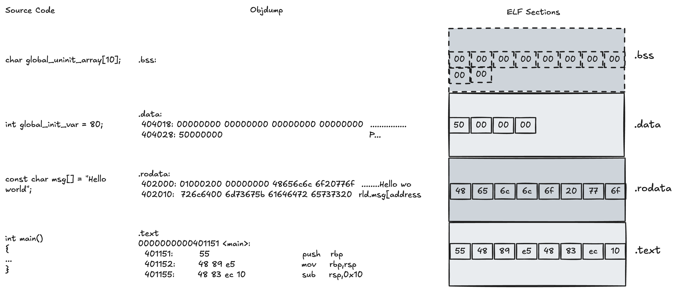

# Chapter 2: Data

## Section 2.1: Introduction
In an operating system, processes compete for resources.
One of the fundamental resources used by all processes is memory.

This chapter digs into the internals of memory management.
But first, a short demo.
In this demo, we’ll run two separate processes — nothing fancy, just simple programs with a global variable.
You can see the code in the snippet below. The source code can be found [here](/demos/introduction/).
```C
#include <stdio.h>
#include <unistd.h>
#include <stdlib.h>

int var;

void usage(char **argv)
{
    fprintf(stderr, "usage: %s <integer>\n", argv[0]);
    exit(1);
}

int main(int argc, char **argv)
{
    if (argc < 2)
        usage(argv);

    var = atoi(argv[1]);
    while (1)
    {
        printf("[%s pid=%d] Address of var: %p, Value of var: %d\n", argv[0], getpid(), &var, var);
        sleep(1);
    }

    return 0;
}
```
Each process will:
* Store the value provided as argument into the global variable `var`
* Print the program name `argv[0]`
* Print the PID of the running process
* Print the address of `var`
* Print the value of `var`, over and over..

We’ll compare the addresses printed by both processes and their coresponding values.
We'll use the auxiliar script [run_demo.sh](/demos/introduction/run_demo.sh) that does exactly what we want.
It spawns the 2 processes from the same executable.
The output should be similiar to the one below.

```bash
root@celeste-5:[introduction]# ./run_demo.sh 
[./introduction pid=156467] Address of var: 0x40404c, Value of var: 200
[./introduction pid=156466] Address of var: 0x40404c, Value of var: 10
[./introduction pid=156467] Address of var: 0x40404c, Value of var: 200
[./introduction pid=156466] Address of var: 0x40404c, Value of var: 10
[./introduction pid=156467] Address of var: 0x40404c, Value of var: 200
[./introduction pid=156466] Address of var: 0x40404c, Value of var: 10
[./introduction pid=156467] Address of var: 0x40404c, Value of var: 200
[./introduction pid=156466] Address of var: 0x40404c, Value of var: 10
```

At first glance, something unexpected (well, depending on your expectations) shows up.
Process with `PID 156467` reports that the value at address `0x40404c` is `200`, while process with `PID 156466` sees `10` at that same address.
Two separate processes — yet something doesn't add up.
Are they sharing memory?
Did the OS mess up?
Or is there something deeper going on?
It seems the processes are isolated, unaware of each other’s memory.
But how is that possible?
Believe it or not, to really understand this... we need an entire chapter.
So let's dive into the magical realm of virtual memory!

## Section 2.2: Executables
Let’s say we have a C application that we want to run on our operating system.
First, the application must be compiled and linked with the required libraries.
The result is an Executable and Linkable Format (ELF) file — a binary that contains everything needed for execution and that the CPU can run.
Running a program means loading this ELF into memory and instructing the CPU to begin executing instructions, typically starting from a function called the entry point, from where execution unfolds.
It’s important to understand that, from the CPU’s perspective, there is no concept of a “variable”.
A variable is simply a region of memory of a given size, and whenever your code accesses one, the compiled instructions operate on its memory address.
Because the ELF is closely tied to memory, it defines a specific layout.
Both instructions and data are divided into sections, which are then mapped into different regions of memory when the program is loaded.
There are many sections in an ELF, but we will focus on the most important ones:
* .text – executable instructions (e.g., main() and other functions).
* .rodata – read-only data (e.g., string literals and const globals).
* .data – initialized global variables.
* .bss – uninitialized global variables.

We will use the following C program (you can find the source code [here](/demos/memory_sections/)) to explore the sections of an ELF file:
```C
#include <stdio.h>
#include <stdlib.h>
#include <unistd.h>

const char msg[] = "Hello world";
int global_init_var = 80;
char global_uninit_array[10];

int function(void)
{
    return 0;
}

int main()
{
    int stack_var = 5;
    char *heap_var = malloc(10);
    heap_var[0] = 'H';
    heap_var[1] = 'E';
    heap_var[2] = 'L';
    heap_var[3] = 'L';
    heap_var[4] = 'O';
    heap_var[5] = 0;

    printf("msg[address %p]: %s\n", msg, msg);
    printf("global_init_var[address %p]: %d\n", &global_init_var, global_init_var);
    printf("global_uninit_array[address %p]: %s\n", &global_uninit_array, global_uninit_array);
    printf("stack_var[address %p]: %d\n", &stack_var, stack_var);
    printf("heap_var[address %p]: %p\n", &heap_var, heap_var);
    printf("*heap_var[address %p]: %s\n", heap_var, heap_var);
    printf("function[address %p]\n", function);
    sleep(20);
}

```

Let’s examine our executable and see what sections the ELF file contains.
We can do this using the `readelf` command with the `-S` option (`-S` stands for “section”; see the `readelf` manual for details):
```
root@celeste-5:[memory_sections]# readelf -S memory_sections
...
  [14] .text             PROGBITS         0000000000401050  00001050
       0000000000000202  0000000000000000  AX       0     0     16
  [15] .fini             PROGBITS         0000000000401254  00001254
       0000000000000009  0000000000000000  AX       0     0     4
  [16] .rodata           PROGBITS         0000000000402000  00002000
       00000000000000e3  0000000000000000   A       0     0     8
  [17] .eh_frame_hdr     PROGBITS         00000000004020e4  000020e4
       0000000000000034  0000000000000000   A       0     0     4
  [18] .eh_frame         PROGBITS         0000000000402118  00002118
       00000000000000c4  0000000000000000   A       0     0     8
  [19] .init_array       INIT_ARRAY       0000000000403de8  00002de8
       0000000000000008  0000000000000008  WA       0     0     8
  [20] .fini_array       FINI_ARRAY       0000000000403df0  00002df0
       0000000000000008  0000000000000008  WA       0     0     8
  [21] .dynamic          DYNAMIC          0000000000403df8  00002df8
       00000000000001e0  0000000000000010  WA       7     0     8
  [22] .got              PROGBITS         0000000000403fd8  00002fd8
       0000000000000010  0000000000000008  WA       0     0     8
  [23] .got.plt          PROGBITS         0000000000403fe8  00002fe8
       0000000000000028  0000000000000008  WA       0     0     8
  [24] .data             PROGBITS         0000000000404010  00003010
       0000000000000014  0000000000000000  WA       0     0     8
  [25] .bss              NOBITS           0000000000404028  00003024
       0000000000000018  0000000000000000  WA       0     0     8
...
```
The  takeaway from examining the ELF sections:
* The .text section has a size of 0x202=514 bytes and will be loaded at address 0x401050.
* The .rodata section has a size of 0xe3=227 bytes and will be loaded at 0x402000.
* The .data section has a size of 0x14=20 bytes, and will be loaded at 0x404010.
* The .bss section, which stores uninitialized global and static variables, has a size of 0x18=24 bytes and will be loaded at 0x404028.
Because .bss is uninitialized, it occupies no space in the ELF file itself; when the program is loaded into memory, the operating system automatically fills this region with zeros.

We can also examine the actual contents of the ELF sections using `objdump`.
Let's start by analysing the .text section.
We used the `-D` option to tell `objdump` to disassemble the machine code into assembly instructions, which are much easier to read than raw hexadecimal bytes.
The `-j` option ensures that we focus only on the section specified, ignoring other parts of the ELF, while `-M intel` specifies that we want the disassembly in Intel syntax instead of AT&T syntax.
```
root@celeste-5:[memory_sections]# objdump  -D -j .text  -M intel memory_sections
memory_sections:     file format elf64-x86-64

Disassembly of section .text:

0000000000401050 <_start>:
  401050:	31 ed                	xor    ebp,ebp
  401052:	49 89 d1             	mov    r9,rdx
...  

0000000000401141 <main>:
  401141:	55                   	push   rbp
  401142:	48 89 e5             	mov    rbp,rsp
  401145:	48 83 ec 10          	sub    rsp,0x10
  401149:	c7 45 fc 05 00 00 00 	mov    DWORD PTR [rbp-0x4],0x5
  401150:	bf 0a 00 00 00       	mov    edi,0xa
```

First, we can see that alongside the code we defined explicitly in our program, there are several other functions, such as `_start`.
These functions are responsible for setting up the execution environment before our main function is called.
The output of the `objdump` command shows the memory addresses of each instruction along with their corresponding assembly code.
So what does the ELF actually contain for the .text section?
For the main function, the content in the ELF file appears as a sequence of bytes, for example:
```
0x55 0x48 0x89 0xe5 0x48 0x83 0xec 0x10 ...
```

At first glance, this may look like gibberish to us, but it is perfectly meaningful to the CPU because these bytes represent machine code.
According to objdump, the first byte, `0x55`, corresponds to the `push rbp` instruction, which saves the base pointer on the stack.
The next three bytes, `0x48 0x89 0xe5`, correspond to `mov rbp, rsp`, setting up the new base pointer for the function’s stack frame.
Together, these instructions form the standard function prologue, which we are all familiar with.
The addresses listed on the left of the disassembly also illustrate how instructions will be laid out sequentially in memory.
For instance, the first instruction at `0x401141` is one byte long, so the next instruction starts at `0x401142`.
The third instruction begins at `0x401145`, three bytes after the previous instruction.

Let's continue by analysing the .rodata section.
Since this section does not contain any executable code, we will change the objdump options accordingly.
Instead of disassembling instructions, we will use the `-s` option to tell objdump to display the full contents of the section in both hexadecimal and ASCII.
This allows us to see the actual data stored in .rodata, rather than interpreting it as machine instructions.
```
root@celeste-5:[memory_sections]# objdump  -s -j .rodata memory_sections

memory_sections:     file format elf64-x86-64

Contents of section .rodata:
 402000 01000200 00000000 48656c6c 6f20776f  ........Hello wo
 402010 726c6400 6d73675b 61646472 65737320  rld.msg[address 
 402020 25705d3a 2025730a 00000000 00000000  %p]: %s.......
```

So what gets stored in .rodata?
In our program, it is the variable `const char msg[] = "Hello world"`, because it is declared as const.
This tells the compiler that the data should be placed in a read-only section of the ELF.
Analyzing the output of objdump, we can see that the left column shows the memory addresses where the data will be stored.
The next four columns show the raw bytes in hexadecimal, and the last column is an attempt to display the same bytes as ASCII characters.
The addresses on the left are spaced 16 bytes apart, because each row displays 16 bytes of data.
Looking closely at the bytes for "Hello world", we can see that the string begins at address `0x402000 + 0x8 = 0x402008` - the bytes `0x48 0x65 0x6c 0x6c 0x6f` correspond to the characters `Hello`.


Now Let's look at the .data section.
```
root@celeste-5:[memory_sections]# objdump  -s -j .data memory_sections
memory_sections:     file format elf64-x86-64

Contents of section .data:
 404010 00000000 00000000 00000000 00000000  ................
 404020 50000000                             P...
```
What gets stored into the .data section?
In our program, it is the variable `int global_init_var = 80"`, because it is an initialized global variable.
Being on a little-endian architecture, the value is stored in the ELF as `0x50 0x00 0x00 0x00`, with 0x50 representing 80 in decimal.
The address for this variable will be `0x404020`.

And finally let's look at the .bss section.
```
root@celeste-5:[memory_sections]# objdump  -s -j .bss memory_sections

memory_sections:     file format elf64-x86-64

```
What gets stored into the .bss section?
In our case will be `char global_uninit_array[10]`, becuase it is an uninitialized global variable.
But objdump doesn’t print anything for this section — is this correct?
Yes, it is.
Since all variables in .bss are initialized to zero at runtime, there is no need to store zeros in the ELF file itself.

Now let's put everything together.
The following diagram shows how our source code is organized in the ELF file.
The first column of the diagram shows the code and the different types of variables defined in our C source code.
The second column represents the objdump output when analyzing the various sections of the ELF.
Finally, the third column illustrates what is actually stored inside the ELF file, specifically highlighting the most relevant sections we have covered so far.

In the .text section we see the sequence of bytes coresponding to the `main()` function.

In the .rodata section we see the sequence of bytes coresponding to our `msg` string.

In the .data section we see the sequence of bytes coresponding to our `global_init_var` variable.

In the .bss section we see the sequence of zeros coresponding to our `global_uninit_array`, but keep in mind that the zeros are not actually in the ELF file.


<div style="text-align: center;">
  
</div>

## Section 2.3: Virtual Address Space
At the highest level, memory holds two fundamental categories of information: code and data.
The code is the sequence of instructions executed by the processor.
It originates from executables, shared libraries, and the operating system kernel, all of which are loaded into memory.
The data consists of the values that programs manipulate.
Its sources are diverse:
*   Static data, defined within the program itself and loaded alongside the executable (for example, global variables and constants).
*   Input data, supplied from the external environment, such as files, network communication, or user interaction.
*   Dynamic data, created during execution through explicit allocation (on the heap, on the stack, on other memory areas) or as results of program computations.

When we run a program in the shell with a command like `./executable`a lot happens behind the scenes.
The operating system creates a new Virtual Address Space(VAS) for the process.
We’ll leave the “Virtual” part aside for now and return to it later — for the moment, we’ll just explore the Address Space itself.
What we need to know for the moment is that each process sees memory as if it owns it entirely.
The loader of the operating system maps the different parts of the ELF file into this address space.
The memory is arranged in a specific layout that corresponds to the ELF format of the executable.

The address space size depends on the size of the CPU registers.
If the registers are 64 bits, that means they can theoretically address 2^64 bytes, which comes out to about 16 million terabytes of memory.
That number is ridiculously large and impossible to implement in practice.
Instead, CPUs use something called the Canonical Address Space.
In a 64-bit model, not all 64 bits are actually used for addressing.
A large portion of the theoretical space is left unused.
On most modern x86-64 systems, the Canonical Address Space is 2^48 bytes, which equals 256 terabytes of virtual memory, which is still huge.
The Canonical Address Space can be seen in the following picture:

<div style="text-align: center;">
  
</div>

* The lower half of the address range (from 0x0000000000000000 up to 0x00007fffffffffff) is reserved for user space.
That gives each process up to 128 TB of virtual memory.

* The upper half of the range (from 0xffff800000000000 up to 0xffffffffffffffff) is reserved for the kernel.
This region is shared among all processes and the operating system itself (more on that later), also amounting to 128 TB.

Let’s focus now on the lower half of the Canonical Address Space — the user space — and see how our ELF is actually loaded into memory.
We'll use the same program described in the [Section 2.2: Executables](#section-22-executables)
The following diagram depicts the main memory regions found in the Virtual Address Space.

<div style="text-align: center;">
  
</div>

These memory regions can be split into two categories: static memory regions and dynamic memory regions.
The static memory regions come directly from the ELF file.
These are the ones we explored earlier: .text, .rodata, .data, and .bss.
The dynamic memory regions are created and modified during the lifetime of the program.
These include the stack, the heap, the libs zone, and other areas that may be allocated at runtime.
Each memory region has associated permissions, usually expressed as Read, Write, Execute (rwx).
These permissions are enforced by the operating system as a security mechanism and describe what the CPU can do when accesing that memory region.
For example, if the CPU tries to execute instructions from an address belonging to a memory region that does not have execute permissions, the program will receive a segmentation fault signal.
Similarly, if the CPU attempts to write to an address belonging to a memory region that does not have write permissions, it will also trigger a segmentation fault.
A very important aspect to remember — and keep this as a rule of thumb — is that, in general, no memory region should have both write and execute permissions at the same time.
Here’s how the ELF sections and memory regions map to permissions:
* The .text section is loaded into a memory region with r-x permissions.
* The .rodata section is loaded into a memory region with r-- permissions.
* The .data section is loaded into a memory region with rw- permissions.
* The .bss section is also loaded into a memory region with rw- permissions.
* The heap and the stack both have rw- permissions.
* The libs region is a generic name for where shared libraries are mapped.
Within each library, different subsections may have different permissions, depending on their role (for example, code vs. data).

We will explore later how these permissions are implemented and why they are such an essential part of memory protection.

Now, let's explore where are the different sections placed into memory.
Note that when running the program, the actual addresses may differ.
However, the general mapping and explanations remain valid.
The program prints several addresses from variables allocated in different sections.
It also sleeps for 20 seconds.
So that we can explore its memory.
Let's run it:
```
root@celeste-5:[memory_sections]: ./memory_sections 
msg[address 0x402008]: Hello world
global_init_var[address 0x404028]: 80
global_uninit_array[address 0x404038]: 
stack_var[address 0x7ffeb5376ffc]: 5
heap_var[address 0x7ffeb5376ff0]: 0x1ee52a0
*heap_var[address 0x1ee52a0]: HELLO
function[address 0x401146]
```

We will use `pmap` to explore the Virtual Address Space of the process.
The `pmap` command shows the starting address of each memory region, the size of the region, its permissions, and the file it comes from.
```
root@celeste-5:[memory_sections]: pmap $(pgrep memory_sections) | cat -n
     1  59053:   ./memory_sections
     2  0000000000400000      4K r---- memory_sections
     3  0000000000401000      4K r-x-- memory_sections
     4  0000000000402000      4K r---- memory_sections
     5  0000000000403000      4K r---- memory_sections
     6  0000000000404000      4K rw--- memory_sections
     7  0000000001ee5000    132K rw---   [ anon ]
     8  00007fe069e5f000     12K rw---   [ anon ]
     9  00007fe069e62000    152K r---- libc.so.6
    10  00007fe069e88000   1364K r-x-- libc.so.6
    11  00007fe069fdd000    332K r---- libc.so.6
    12  00007fe06a030000     16K r---- libc.so.6
    13  00007fe06a034000      8K rw--- libc.so.6
    14  00007fe06a036000     52K rw---   [ anon ]
    15  00007fe06a064000      8K rw---   [ anon ]
    16  00007fe06a066000      4K r---- ld-linux-x86-64.so.2
    17  00007fe06a067000    148K r-x-- ld-linux-x86-64.so.2
    18  00007fe06a08c000     40K r---- ld-linux-x86-64.so.2
    19  00007fe06a096000      8K r---- ld-linux-x86-64.so.2
    20  00007fe06a098000      8K rw--- ld-linux-x86-64.so.2
    21  00007ffeb5357000    132K rw---   [ stack ]
    22  00007ffeb53ed000     16K r----   [ anon ]
    23  00007ffeb53f1000      8K r-x--   [ anon ]
    24   total             2460K
```
* `msg` is in the .rodata section, so it belongs to a memory region with read-only permissions.
Its address is 0x402008, which falls inside the region on line 4 of the pmap output.
This region starts at 0x0000000000402000, has a size of 4K, has r__ permissions,and, as shown in the last column, comes from the executable itself.

* `global_init_var` is in the .data section because it is a global initialized variable.
Therefore, it should be located in a memory region with read and write permissions.
Its address is 0x404028, and we can see that it belongs to the region starting at 0x0000000000404000 on line 6.
This region also comes from the executable, and the rw- permissions confirm that it allows both reading and writing.

* `global_uninit_array` is in the .bss section because it is a global uninitialized variable.
Just like .data, this section should be placed in a region with read and write permissions.
Its address is 0x404038, which again falls inside the region starting at 0x0000000000404000 on line 6.
In this case both .data and .bss share the same memory region with rw-- permissions.

* `stack_var` lives on the stack, so it should be located in a memory region with read and write permissions.
Its address is `0x7ffeb5376ffc`, which belongs to the region on line 21 of the pmap output.
This region is labeled [ stack ] and has rw- permissions, exactly as expected.

* `heap_var` variable is pointer variable that is actually located on the stack.
Its address is `0x7ffeb5376ff0`, which falls inside the stack region on line 21.
As a pointer variable it contains a pointer to another memory area, in this case a memory area allocated on the heap with `malloc()`.
So the content of `heap_var`, i.e. address `0x1ee52a0` falls in region on line 7.
This is the heap of the program.
The [anon] label means that the memory is anonymous and is not backed up by a file.

* The function symbol corresponds to our user-defined function in the .text section.
Its address is `0x401146`, which falls inside the region on line 3 starting at 0x0000000000401000.
This region has r-x-- permissions, meaning it is executable but not writable, exactly what we expect for code.
The last column shows that it comes from the executable itself.