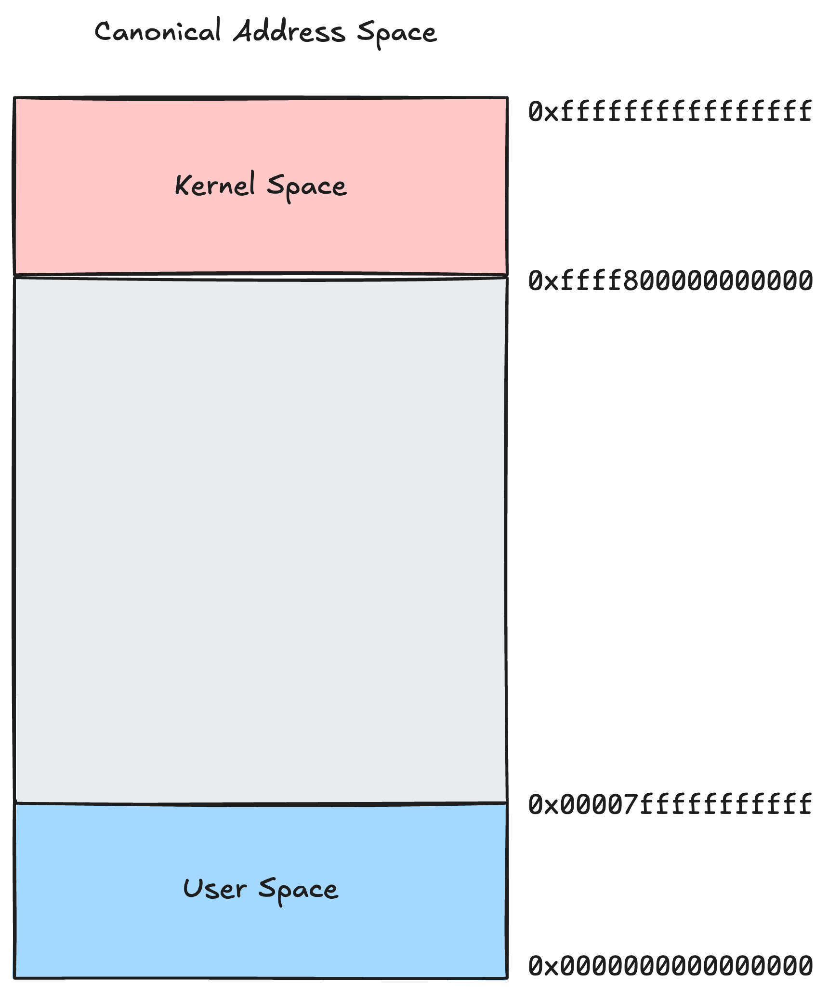

# Chapter 2: Data

## Section 2.1: Introduction
In an operating system, processes compete for resources.
One of the fundamental resources used by all processes is memory.

This chapter digs into the internals of memory management.
But first, a short demo.
In this demo, we’ll run two separate processes — nothing fancy, just simple programs with a global variable.
You can see the code in the snippet below. The source code can be found [here](/demos/introduction/).
```C
#include <stdio.h>
#include <unistd.h>
#include <stdlib.h>

int var;

void usage(char **argv)
{
    fprintf(stderr, "usage: %s <integer>\n", argv[0]);
    exit(1);
}

int main(int argc, char **argv)
{
    if (argc < 2)
        usage(argv);

    var = atoi(argv[1]);
    while (1)
    {
        printf("[%s pid=%d] Address of var: %p, Value of var: %d\n", argv[0], getpid(), &var, var);
        sleep(1);
    }

    return 0;
}
```
Each process will:
* Store the value provided as argument into the global variable `var`
* Print the program name `argv[0]`
* Print the PID of the running process
* Print the address of `var`
* Print the value of `var`, over and over..

We’ll compare the addresses printed by both processes and their coresponding values.
We'll use the auxiliar script [run_demo.sh](/demos/introduction/run_demo.sh) that does exactly what we want.
It spawns the 2 processes from the same executable.
The output should be similiar to the one below:

```bash
root@celeste-5:[introduction]# ./run_demo.sh 
[./introduction pid=156467] Address of var: 0x40404c, Value of var: 200
[./introduction pid=156466] Address of var: 0x40404c, Value of var: 10
[./introduction pid=156467] Address of var: 0x40404c, Value of var: 200
[./introduction pid=156466] Address of var: 0x40404c, Value of var: 10
[./introduction pid=156467] Address of var: 0x40404c, Value of var: 200
[./introduction pid=156466] Address of var: 0x40404c, Value of var: 10
[./introduction pid=156467] Address of var: 0x40404c, Value of var: 200
[./introduction pid=156466] Address of var: 0x40404c, Value of var: 10
```

At first glance, something unexpected (well, depending on your expectations) shows up.
Process with `PID 156467` reports that the value at address `0x40404c` is `200`, while process with `PID 156466` sees `10` at that same address.
Two separate processes — yet something doesn't add up.
Are they sharing memory?
Did the OS mess up?
Or is there something deeper going on?
It seems the processes are isolated, unaware of each other’s memory.
But how is that possible?
Believe it or not, to really understand this... we need an entire chapter.
So let's dive into the magical realm of virtual memory!

## Disclaimer
The following sections deal with memory and addresses. To make the concepts easier to follow, most of the demos are run with ASLR (Address Space Layout Randomization) disabled.
We'll cover ASLR later in this material.

If you want to try the demos yourself (and we encourage you to do so), you can disable ASLR with:
```
echo 0 | sudo tee /proc/sys/kernel/randomize_va_space
```

When you’re done experimenting, make sure to restore it with:
```
echo 2 | sudo tee /proc/sys/kernel/randomize_va_space
```

Keep in mind that even with ASLR disabled, some addresses may still differ slightly from the ones shown in this material.
Aside from these minor differences in numbers, the explanations and conclusions remain fully valid.

## Section 2.2: Executables
Let’s say we have a C application that we want to run on our operating system.
First, the application must be compiled and linked with the required libraries.
The result is an Executable and Linkable Format (ELF) file — a binary that contains everything needed for execution and that the CPU can run.
Running a program means loading this ELF into memory and instructing the CPU to begin executing instructions, typically starting from a function called the entry point.
After calling the entry point the execution unfolds.
It’s important to understand that, from the CPU’s perspective, there is no concept of a “variable”.
A variable is simply a region of memory of a given size, and whenever your code accesses one, the compiled instructions operate on its memory address.
Because the ELF is closely tied to memory, it defines a specific layout.
Both instructions and data are divided into sections, which are then mapped into different regions of memory when the program is loaded.
There are many sections in an ELF, but we will focus on the most important ones:
* .text – executable instructions (e.g., `main()` and other functions).
* .rodata – read-only data (e.g., string literals and const globals).
* .data – initialized global variables.
* .bss – uninitialized global variables.

We will use the following C program (you can find the source code [here](/demos/memory_sections/)) to explore the sections of an ELF file:
```C
#include <stdio.h>
#include <stdlib.h>
#include <unistd.h>

const char msg[] = "Hello world";
int global_init_var = 80;
char global_uninit_array[10];

int function(void)
{
    return 0;
}

int main()
{
    int stack_var = 5;
    char *heap_var = malloc(10);
    heap_var[0] = 'H';
    heap_var[1] = 'E';
    heap_var[2] = 'L';
    heap_var[3] = 'L';
    heap_var[4] = 'O';
    heap_var[5] = 0;

    printf("msg[address %p]: %s\n", msg, msg);
    printf("global_init_var[address %p]: %d\n", &global_init_var, global_init_var);
    printf("global_uninit_array[address %p]: %s\n", &global_uninit_array, global_uninit_array);
    printf("stack_var[address %p]: %d\n", &stack_var, stack_var);
    printf("heap_var[address %p]: %p\n", &heap_var, heap_var);
    printf("*heap_var[address %p]: %s\n", heap_var, heap_var);
    printf("function[address %p]\n", function);
    sleep(20);
}

```

Let’s examine our executable and see what sections the ELF file contains.
We can do this using the `readelf` command with the `-S` option (`-S` stands for “section”; see the `readelf` manual for details):
```
root@celeste-5:[memory_sections]# readelf -S memory_sections
...
 [14] .text             PROGBITS         0000000000401060  00001060
       000000000000020c  0000000000000000  AX       0     0     16
  [15] .fini             PROGBITS         000000000040126c  0000126c
       0000000000000009  0000000000000000  AX       0     0     4
  [16] .rodata           PROGBITS         0000000000402000  00002000
       00000000000000e3  0000000000000000   A       0     0     8
  [17] .eh_frame_hdr     PROGBITS         00000000004020e4  000020e4
       0000000000000034  0000000000000000   A       0     0     4
  [18] .eh_frame         PROGBITS         0000000000402118  00002118
       00000000000000c4  0000000000000000   A       0     0     8
  [19] .init_array       INIT_ARRAY       0000000000403de8  00002de8
       0000000000000008  0000000000000008  WA       0     0     8
  [20] .fini_array       FINI_ARRAY       0000000000403df0  00002df0
       0000000000000008  0000000000000008  WA       0     0     8
  [21] .dynamic          DYNAMIC          0000000000403df8  00002df8
       00000000000001e0  0000000000000010  WA       7     0     8
  [22] .got              PROGBITS         0000000000403fd8  00002fd8
       0000000000000010  0000000000000008  WA       0     0     8
  [23] .got.plt          PROGBITS         0000000000403fe8  00002fe8
       0000000000000030  0000000000000008  WA       0     0     8
  [24] .data             PROGBITS         0000000000404018  00003018
       0000000000000014  0000000000000000  WA       0     0     8
  [25] .bss              NOBITS           0000000000404030  0000302c
       0000000000000018  0000000000000000  WA       0     0     8
...
```
The  takeaway from examining the ELF sections:
* The .text section has a size of `0x20c=524` bytes and will be loaded at address `0x401060`.
* The .rodata section has a size of `0xe3=227` bytes and will be loaded at `0x402000`.
* The .data section has a size of `0x14=20` bytes, and will be loaded at `0x404018`.
* The .bss section, which stores uninitialized global and static variables, has a size of `0x18=24` bytes and will be loaded at `0x404030`.
Because .bss is uninitialized, it occupies no space in the ELF file itself.
We can confirm that by looking at the output of `readelf` which tells us that this section has `NOBITS`.
When the program is loaded into memory, the operating system automatically fills this region with zeros.

Another important piece of information we can obtain using `readelf` is the entry point of the executable.
To find it, we use the `-h` option, which reads the ELF file header — metadata describing the ELF file.
```
ELF Header:
  Magic:   7f 45 4c 46 02 01 01 00 00 00 00 00 00 00 00 00 
  Class:                             ELF64
  Data:                              2's complement, little endian
  Version:                           1 (current)
  OS/ABI:                            UNIX - System V
  ABI Version:                       0
  Type:                              EXEC (Executable file)
  Machine:                           Advanced Micro Devices X86-64
  Version:                           0x1
  Entry point address:               0x401060
  Start of program headers:          64 (bytes into file)
  Start of section headers:          15488 (bytes into file)
  Flags:                             0x0
  Size of this header:               64 (bytes)
  Size of program headers:           56 (bytes)
  Number of program headers:         13
  Size of section headers:           64 (bytes)
  Number of section headers:         36
  Section header string table index: 35
```

There is a lot of useful information here, but since our focus is not advanced binary analysis, the most important detail is the entry point address.
The entry point is where program execution begins — in other words, it is the address where the instruction pointer jumps when the program starts.
In our case, the entry point is at address `0x401060`.

We can also examine the actual contents of the ELF sections using `objdump`.
Let's start by analysing the .text section.
We used the `-D` option to tell `objdump` to disassemble the machine code into assembly instructions, which are much easier to read than raw hexadecimal bytes.
The `-j` option ensures that we focus only on the section specified, ignoring other parts of the ELF, while `-M intel` specifies that we want the disassembly in Intel syntax instead of AT&T syntax.
```
root@celeste-5:[memory_sections]# objdump  -D -j .text  -M intel memory_sections
memory_sections:     file format elf64-x86-64

Disassembly of section .text:

0000000000401060 <_start>:
  401060:	31 ed                	xor    ebp,ebp
  401062:	49 89 d1             	mov    r9,rdx
...
0000000000401151 <main>:
  401151:	55                   	push   rbp
  401152:	48 89 e5             	mov    rbp,rsp
  401155:	48 83 ec 10          	sub    rsp,0x10

```

First, we can see that alongside the code we defined explicitly in our program, there are several other functions, such as `_start`.
We see that the `_start` function begins at address `0x401060`.
This is the same address that `readelf` told us is the entry point.
So `_start` is the entry point in our program and is responsible for setting up the execution environment before our `main()` function is called.
The output of the `objdump` command shows the memory addresses of each instruction along with their corresponding assembly code.
So what does the ELF actually contain for the .text section?
For the `main()` function, the content in the ELF file appears as a sequence of bytes, for example:
```
0x55 0x48 0x89 0xe5 0x48 0x83 0xec 0x10 ...
```

At first glance, this may look like gibberish to us, but it is perfectly meaningful to the CPU because these bytes represent machine code.
According to objdump, the first byte, `0x55`, corresponds to the `push rbp` instruction, which saves the base pointer on the stack.
The next three bytes, `0x48 0x89 0xe5`, correspond to `mov rbp, rsp`, setting up the new base pointer for the function’s stack frame.
Together, these instructions form the standard function prologue, which we are all familiar with.
The addresses listed on the left of the disassembly also illustrate how instructions will be laid out sequentially in memory.
For instance, the first instruction at `0x401151` is one byte long, so the next instruction starts at `0x401152`.
The third instruction begins at `0x401155`, three bytes after the previous instruction.

Let's continue by analysing the .rodata section.
Since this section does not contain any executable code, we will change the objdump options accordingly.
Instead of disassembling instructions, we will use the `-s` option to tell objdump to display the full contents of the section in both hexadecimal and ASCII.
This allows us to see the actual data stored in .rodata, rather than interpreting it as machine instructions.
```
root@celeste-5:[memory_sections]# objdump  -s -j .rodata memory_sections

memory_sections:     file format elf64-x86-64

Contents of section .rodata:
 402000 01000200 00000000 48656c6c 6f20776f  ........Hello wo
 402010 726c6400 6d73675b 61646472 65737320  rld.msg[address 
 402020 25705d3a 2025730a 00000000 00000000  %p]: %s.........
```

So what gets stored in .rodata?
In our program, it is the variable `const char msg[] = "Hello world"`, because it is declared as const.
This tells the compiler that the data should be placed in a read-only section of the ELF.
Analyzing the output of objdump, we can see that the left column shows the memory addresses where the data will be stored.
The next four columns show the raw bytes in hexadecimal, and the last column is an attempt to display the same bytes as ASCII characters.
The addresses on the left are spaced 16 bytes apart, because each row displays 16 bytes of data.
Looking closely at the bytes for "Hello world", we can see that the string begins at address `0x402000 + 0x8 = 0x402008` - the bytes `0x48 0x65 0x6c 0x6c 0x6f` correspond to the characters `Hello`.


Now Let's look at the .data section.
```
root@celeste-5:[memory_sections]# objdump  -s -j .data memory_sections
memory_sections:     file format elf64-x86-64

Contents of section .data:
 404018 00000000 00000000 00000000 00000000  ................
 404028 50000000                             P...     
```
What gets stored into the .data section?
In our program, it is the variable `int global_init_var = 80`, because it is an initialized global variable.
Being on a little-endian architecture, the value is stored in the ELF as `0x50 0x00 0x00 0x00`, with 0x50 representing 80 in decimal.
The address for this variable will be `0x404028`.

And finally let's look at the .bss section.
```
root@celeste-5:[memory_sections]# objdump  -s -j .bss memory_sections

memory_sections:     file format elf64-x86-64

```
What gets stored into the .bss section?
In our case will be `char global_uninit_array[10]`, becuase it is an uninitialized global variable.
But objdump doesn’t print anything for this section — is this correct?
Yes, it is.
Since all variables in .bss are initialized to zero at runtime, there is no need to store zeros in the ELF file itself.

Now let's put everything together.
The following diagram shows how our source code is organized in the ELF file.
The first column of the diagram shows the code and the different types of variables defined in our C source code.
The second column represents the objdump output when analyzing the various sections of the ELF.
Finally, the third column illustrates what is actually stored inside the ELF file, specifically highlighting the most relevant sections we have covered so far.

In the .text section we see the sequence of bytes coresponding to the `main()` function.

In the .rodata section we see the sequence of bytes coresponding to our `msg` string.

In the .data section we see the sequence of bytes coresponding to our `global_init_var` variable.

In the .bss section we see the sequence of zeros coresponding to our `global_uninit_array`, but keep in mind that the zeros are not actually in the ELF file.


<div style="text-align: center;">
  
</div>

## Section 2.3: Virtual Address Space
At the highest level, memory holds two fundamental categories of information: code and data.
The code is the sequence of instructions executed by the processor.
It originates from executables, shared libraries, and the operating system kernel, all of which are loaded into memory.
The data consists of the values that programs manipulate.
Its sources are diverse:
*   Static data, defined within the program itself and loaded alongside the executable (for example, global variables and constants).
*   Input data, supplied from the external environment, such as files, network communication, or user interaction.
*   Dynamic data, created during execution through explicit allocation (on the heap, on the stack, on other memory areas) or as results of program computations.

When we run a program in the shell with a command like `./executable`a lot happens behind the scenes.
The operating system creates a new Virtual Address Space(VAS) for the process.
We’ll leave the “Virtual” part aside for now and return to it later — for the moment, we’ll just explore the Address Space itself.
What we need to know for the moment is that each process sees memory as if it owns it entirely.
The loader of the operating system maps the different parts of the ELF file into this address space.
The memory is arranged in a specific layout that corresponds to the ELF format of the executable.

The address space size depends on the size of the CPU registers.
If the registers are 64 bits, that means they can theoretically address 2^64 bytes, which comes out to about 16 million terabytes of memory.
That number is ridiculously large and impossible to implement in practice.
Instead, CPUs use something called the Canonical Address Space.
In a 64-bit model, not all 64 bits are actually used for addressing.
A large portion of the theoretical space is left unused.
On most modern x86-64 systems, the Canonical Address Space is 2^48 bytes, which equals 256 terabytes of virtual memory, which is still huge...
You might think that no computer has that much RAM, and you’d be correct.
The point is that we won’t actually use all of this memory; the large address space simply provides room for mapping virtual memory as needed...
Yes, virtual!
More on that later!
The Canonical Address Space can be seen in the following picture:

<div style="text-align: center;">
  
</div>

* The lower half of the address range (from `0x0000000000000000` up to `0x00007fffffffffff`) is reserved for user space.
That gives each process up to 128 TB of virtual memory.

* The upper half of the range (from `0xffff800000000000` up to `0xffffffffffffffff`) is reserved for the kernel.
This region is shared among all processes and the operating system itself (more on that later), also amounting to 128 TB.

Let’s focus now on the lower half of the Canonical Address Space — the user space — and see how our ELF is actually loaded into memory.
We'll use the same program described in the [Section 2.2: Executables](#section-22-executables)
The following diagram depicts the main memory regions found in the Virtual Address Space.

<div style="text-align: center;">
  
</div>

These memory regions can be split into two categories:
* Static memory regions - The static memory regions come directly from the ELF file.
These are the ones we explored earlier: .text, .rodata, .data, and .bss.
* Dynamic memory regions - The dynamic memory regions are created and modified during the lifetime of the program.
These include the stack, the heap, the libs zone, and other areas that may be allocated at runtime.

Each memory region has associated permissions, usually expressed as Read, Write, Execute (rwx).
These permissions are enforced by the operating system as a security mechanism and describe what the CPU can do when accesing that memory region.
For example, if the CPU tries to execute instructions from an address belonging to a memory region that does not have execute permissions, the program will receive a segmentation fault signal.
Similarly, if the CPU attempts to write to an address belonging to a memory region that does not have write permissions, it will also trigger a segmentation fault.
A very important aspect to remember — and keep this as a rule of thumb — is that, in general, no memory region should have both write and execute permissions at the same time.
This security policy is called W xor X (Write xor Execute).
Here’s how the ELF sections and memory regions map to permissions:
* The .text section is loaded into a memory region with r-x permissions.
* The .rodata section is loaded into a memory region with r-- permissions.
* The .data section is loaded into a memory region with rw- permissions.
* The .bss section is also loaded into a memory region with rw- permissions.
* The heap and the stack both have rw- permissions.
* The libs region is a generic name for where shared libraries are mapped.
For each library, different subsections may have different permissions, depending on their role (for example, code vs. data).

We will explore later how these permissions are implemented and why they are such an essential part of memory protection.

Now, let's see how different sections are placed in memory.
The program prints several addresses from variables allocated in different sections.
It also sleeps for 20 seconds.
So that we can explore its memory.
Let's run it:
```
root@celeste-5:[memory_sections]: ./memory_sections 
msg[address 0x402008]: Hello world
global_init_var[address 0x404028]: 80
global_uninit_array[address 0x404038]: 
stack_var[address 0x7fffffffdffc]: 5
heap_var[address 0x7fffffffdff0]: 0x4052a0
*heap_var[address 0x4052a0]: HELLO
function[address 0x401146]
```

We will use `pmap` to explore the Virtual Address Space of the process.
The `pmap` command shows the starting address of each memory region, the size of the region, its permissions, and the ELF it comes from (if it comes from an ELF).
```
root@celeste-5:[memory_sections]: pmap $(pgrep memory_sections) | cat -n
     1  83516:   ./memory_sections
     2  0000000000400000      4K r---- memory_sections
     3  0000000000401000      4K r-x-- memory_sections
     4  0000000000402000      4K r---- memory_sections
     5  0000000000403000      4K r---- memory_sections
     6  0000000000404000      4K rw--- memory_sections
     7  0000000000405000    132K rw---   [ anon ]
     8  00007ffff7dbe000     12K rw---   [ anon ]
     9  00007ffff7dc1000    152K r---- libc.so.6
    10  00007ffff7de7000   1364K r-x-- libc.so.6
    11  00007ffff7f3c000    332K r---- libc.so.6
    12  00007ffff7f8f000     16K r---- libc.so.6
    13  00007ffff7f93000      8K rw--- libc.so.6
    14  00007ffff7f95000     52K rw---   [ anon ]
    15  00007ffff7fc3000      8K rw---   [ anon ]
    16  00007ffff7fc5000     16K r----   [ anon ]
    17  00007ffff7fc9000      8K r-x--   [ anon ]
    18  00007ffff7fcb000      4K r---- ld-linux-x86-64.so.2
    19  00007ffff7fcc000    148K r-x-- ld-linux-x86-64.so.2
    20  00007ffff7ff1000     40K r---- ld-linux-x86-64.so.2
    21  00007ffff7ffb000      8K r---- ld-linux-x86-64.so.2
    22  00007ffff7ffd000      8K rw--- ld-linux-x86-64.so.2
    23  00007ffffffde000    132K rw---   [ stack ]
    24   total             2460K
```
Now let's see how the output of the program matches the output of `pmap`:

* `msg` is in the .rodata section, so it belongs to a memory region with read-only permissions.
Its address is `0x402008`, which falls inside the region on line 4 of the pmap output.
This region starts at `0x0000000000402000`, has a size of 4KB, has r-- permissions, and, as shown in the last column, comes from the executable itself.

* `global_init_var` is in the .data section because it is a global initialized variable.
Therefore, it should be located in a memory region with read and write permissions.
Its address is `0x404028`, and we can see that it belongs to the region starting at `0x0000000000404000` on line 6.
This region also comes from the executable, and the rw- permissions confirm that it allows both reading and writing.

* `global_uninit_array` is in the .bss section because it is a global uninitialized variable.
Just like .data, this section should be placed in a region with read and write permissions.
Its address is `0x404038`, which again falls inside the region starting at `0x0000000000404000` on line 6.
In this case both .data and .bss share the same memory region with rw- permissions.

* `stack_var` lives on the stack, so it should be located in a memory region with read and write permissions.
Its address is `0x7fffffffdffc`, which belongs to the region on line 23 of the pmap output.
This region is labeled [ stack ] and has rw- permissions, exactly as expected.

* `heap_var` variable is a pointer variable that is actually located on the stack.
Its address is `0x7fffffffdff0`, which falls inside the stack region on line 21.
As a pointer variable it contains a pointer to another memory area, in this case a memory area allocated on the heap with `malloc()`.
So the content of `heap_var`, i.e. address `0x4052a0` falls in region on line 7.
This is the heap of the program.
The [anon] label means that the memory is anonymous and is not backed up by a file.

* The function symbol corresponds to our user-defined function in the .text section.
Its address is `0x401146`, which falls inside the region on line 3 starting at `0x0000000000401000`.
This region has r-x- permissions, meaning it is executable but not writable, exactly what we expect for code.
The last column shows that it comes from the executable itself.

## Section 2.4: Memory Allocation
What does memory allocation mean?
Well, it can mean several things.
If we examine the memory regions of a program — for example, those shown by the `pmap` utility — we can say that this memory is allocated, or more precisely, reserved.
These regions are reserved from the vast virtual address space we discussed earlier.
What does this mean?
It means the program can safely access addresses within these ranges without causing a segmentation fault, provided it respects the permissions of each region.
Attempting to access memory outside these regions will immediately trigger a segfault.
So, who reserves this memory?
The operating system.
It reserves memory when loading the ELF and can also reserve memory dynamically during program execution using system calls such as `brk()` and `mmap()`.
One would ask, where does `malloc()` fit in?
Here we begin to see why “memory allocation” can have multiple meanings.
There are at least two levels of allocation:
* System-level allocation, performed by the OS indirectly (automatically) or directly via syscalls like `brk()` and `mmap()`.
* Library-level allocation, handled by the standard C library, which manages the memory obtained from the system for the program.
An example is the `malloc()` function.

Now, let's take a step back and look again at the `pmap` output for the `memory_sections` process.
```
root@celeste-5:[memory_sections]: pmap $(pgrep memory_sections) | cat -n
     1  83516:   ./memory_sections
     2  0000000000400000      4K r---- memory_sections
     3  0000000000401000      4K r-x-- memory_sections
     4  0000000000402000      4K r---- memory_sections
     5  0000000000403000      4K r---- memory_sections
     6  0000000000404000      4K rw--- memory_sections
     7  0000000000405000    132K rw---   [ anon ]
     8  00007ffff7dbe000     12K rw---   [ anon ]
     9  00007ffff7dc1000    152K r---- libc.so.6
    10  00007ffff7de7000   1364K r-x-- libc.so.6
    11  00007ffff7f3c000    332K r---- libc.so.6
    12  00007ffff7f8f000     16K r---- libc.so.6
    13  00007ffff7f93000      8K rw--- libc.so.6
    14  00007ffff7f95000     52K rw---   [ anon ]
    15  00007ffff7fc3000      8K rw---   [ anon ]
    16  00007ffff7fc5000     16K r----   [ anon ]
    17  00007ffff7fc9000      8K r-x--   [ anon ]
    18  00007ffff7fcb000      4K r---- ld-linux-x86-64.so.2
    19  00007ffff7fcc000    148K r-x-- ld-linux-x86-64.so.2
    20  00007ffff7ff1000     40K r---- ld-linux-x86-64.so.2
    21  00007ffff7ffb000      8K r---- ld-linux-x86-64.so.2
    22  00007ffff7ffd000      8K rw--- ld-linux-x86-64.so.2
    23  00007ffffffde000    132K rw---   [ stack ]
    24   total             2460K
```
Is there something special about the sizes of the memory regions?
All memory regions have sizes that are multiples of 4 KB.
Why is that?
For two main reasons:
* The operating system manages memory in pages, and the standard page size is 4 KB.
We’ll see later why.
* System calls are relatively expensive, so the OS avoids handling very small allocations directly.

Let's see how is memory allocated in different scenarios.

### Heap Memory Allocation
The heap is a memory region, just like all the other regions, and it is essentially an extension of the data segment.
This means it is located after the .data and .bss sections in memory.
The end of the heap is called the program break.
The operating system only knows about the program break.
For each process, the OS stores the program break in a special structure called the Process Control Block (PCB).
We will discuss the PCB in more detail in later chapters.
When a program requests more heap memory, the OS can move the program break to reserve additional space.
This is done using the system calls `brk()` and `sbrk()`.
The difference between the two is:
* `brk()` sets the program break to a specific address.
* `sbrk()` increments or decrements the current program break by a given offset.
It is also important to note that `sbrk()` returns the previous value of the program break before the increment.

Let's look at a simple program that uses `sbrk()` to allocate heap memory (you can find the source code [here](/demos/sbrk_allocation/)):
```C
#include "print_helpers.h"

int main()
{
    char c;
    void *new_brk, *initial_brk, *old_brk;

    initial_brk = sbrk(0);
    PRINT_PTR("The initial program break is:", initial_brk);
    PRINT_MSG("Press ENTER to coninue\n\n");
    read(0, &c, sizeof(c));

    PRINT_MSG("Allocate 1024 bytes from System Memory using sbrk(1024)\n")
    old_brk = sbrk(1024);
    new_brk = sbrk(0);
    if (new_brk == (void *)-1)
    {
        PRINT_MSG("sbrk() failed\n");
    }
    PRINT_PTR("OLD program break is:", old_brk);
    PRINT_PTR("NEW program break is:", new_brk);
    PRINT_MSG("Press ENTER to coninue\n\n");
    read(0, &c, sizeof(c));

    PRINT_MSG("Allocate 2048 bytes from System Memory using sbrk(2048)\n")
    old_brk = sbrk(2048);
    new_brk = sbrk(0);
    if (new_brk == (void *)-1)
    {
        PRINT_MSG("sbrk() failed\n");
    }
    PRINT_PTR("OLD program break is:", old_brk);
    PRINT_PTR("NEW program break is:", new_brk);
    PRINT_MSG("Press ENTER to coninue\n\n");
    read(0, &c, sizeof(c));

    PRINT_MSG("Allocate 4096 bytes from System Memory using sbrk(4096)\n")
    old_brk = sbrk(4096);
    new_brk = sbrk(0);
    if (new_brk == (void *)-1)
    {
        PRINT_MSG("sbrk() failed\n");
    }
    PRINT_PTR("OLD program break is:", old_brk);
    PRINT_PTR("NEW program break is:", new_brk);
    PRINT_MSG("Press ENTER to coninue\n\n");
    read(0, &c, sizeof(c));

    return 0;
}
```
This program demonstrates how to use `sbrk()` to allocate heap memory.
At the start, it prints the initial program break value.
It does this by invoking `sbrk(0)` which means give me the current program break.
Then, it performs three separate `sbrk()` calls to extend the program break:
* The first call extends the program break by 1024 bytes.
* The second call extends it by 2048 bytes.
* The third call extends it by 4096 bytes.
For each allocation, the program prints both the old program break (before the call) and the new program break (after the call).
As stated befor `sbrk()` returns the old program break so to get the new one after an allocation we get it using an `sbrk(0)`.

Let's run the program.
Between each step, the program pauses so we can inspect the memory using `pmap`.
We can continue the execution by pressing the ENTER key on the keyboard.

```
root@celeste-5:[sbrk_allocation]# ./sbrk_allocation 
The initial program break is: 0x0000000000405000
Press ENTER to coninue
```
```
root@celeste-5:[sbrk_allocation]# pmap $(pgrep sbrk_allocation) | cat -n
     1  78403:   ./sbrk_allocation
     2  0000000000400000      4K r---- sbrk_allocation
     3  0000000000401000      4K r-x-- sbrk_allocation
     4  0000000000402000      4K r---- sbrk_allocation
     5  0000000000403000      4K r---- sbrk_allocation
     6  0000000000404000      4K rw--- sbrk_allocation
     7  00007ffff7dbe000     12K rw---   [ anon ]
...
```
We see that the OS dind't reserve anything for the heap yet.
There's no regions for our address.

Let's Continue with the `sbrk(1024)`:
```
root@celeste-5:[sbrk_allocation]# ./sbrk_allocation 
The initial program break is: 0x0000000000405000
Press ENTER to coninue


Allocate 1024 bytes from System Memory using sbrk(1024)
OLD program break is: 0x0000000000405000
NEW program break is: 0x0000000000405400
Press ENTER to coninue
```
```
root@celeste-5:[sbrk_allocation]# pmap $(pgrep sbrk_allocation) | cat -n
     1  78403:   ./sbrk_allocation
     2  0000000000400000      4K r---- sbrk_allocation
     3  0000000000401000      4K r-x-- sbrk_allocation
     4  0000000000402000      4K r---- sbrk_allocation
     5  0000000000403000      4K r---- sbrk_allocation
     6  0000000000404000      4K rw--- sbrk_allocation
     7  0000000000405000      4K rw---   [ anon ]
...
```
What we can see is that when invoking `sbrk(1024)` the OS reserved a page of memory.
The new program break is `0x0000000000405400`.
The old program break is `0x0000000000405000`.
So between the new program break and the old program break there are `0x400 = 1024` bytes.
Even though we only asked for 1024 bytes, the kernel allocated a full 4 KB page, because memory is always managed in pages.
The program break advanced exactly by 1024 bytes, but it still lies within this first allocated page.

Let's continue:
```
root@celeste-5:[sbrk_allocation]# ./sbrk_allocation 
The initial program break is: 0x0000000000405000
Press ENTER to coninue


Allocate 1024 bytes from System Memory using sbrk(1024)
OLD program break is: 0x0000000000405000
NEW program break is: 0x0000000000405400
Press ENTER to coninue


Allocate 2048 bytes from System Memory using sbrk(2048)
OLD program break is: 0x0000000000405400
NEW program break is: 0x0000000000405c00
Press ENTER to coninue
```
```
root@celeste-5:[sbrk_allocation]# pmap $(pgrep sbrk_allocation) | cat -n
     1  78403:   ./sbrk_allocation
     2  0000000000400000      4K r---- sbrk_allocation
     3  0000000000401000      4K r-x-- sbrk_allocation
     4  0000000000402000      4K r---- sbrk_allocation
     5  0000000000403000      4K r---- sbrk_allocation
     6  0000000000404000      4K rw--- sbrk_allocation
     7  0000000000405000      4K rw---   [ anon ]
...
```
What we can see is that when invoking `sbrk(2048)` the pmap output is unchanged — still one 4 KB page.
This is because the new program break still falls inside the already allocated page, so the kernel didn’t need to allocate anything new.
However, it updated the new program break and is  `2048` bytes away from the old program break.

Let's continue:
```
root@celeste-5:[sbrk_allocation]# ./sbrk_allocation 
The initial program break is: 0x0000000000405000
Press ENTER to coninue


Allocate 1024 bytes from System Memory using sbrk(1024)
OLD program break is: 0x0000000000405000
NEW program break is: 0x0000000000405400
Press ENTER to coninue


Allocate 2048 bytes from System Memory using sbrk(2048)
OLD program break is: 0x0000000000405400
NEW program break is: 0x0000000000405c00
Press ENTER to coninue


Allocate 4096 bytes from System Memory using sbrk(4096)
OLD program break is: 0x0000000000405c00
NEW program break is: 0x0000000000406c00
Press ENTER to coninue
```
```
root@celeste-5:~# pmap $(pgrep sbrk_allocation) | cat -n
     1  78403:   ./sbrk_allocation
     2  0000000000400000      4K r---- sbrk_allocation
     3  0000000000401000      4K r-x-- sbrk_allocation
     4  0000000000402000      4K r---- sbrk_allocation
     5  0000000000403000      4K r---- sbrk_allocation
     6  0000000000404000      4K rw--- sbrk_allocation
     7  0000000000405000      8K rw---   [ anon ]
...
```
What happened here?
This time the program break has moved beyond the limits of the current page.
As a result, the kernel allocated an additional 4 KB page, and the memory region from line 7 grew from 4 KB to 8 KB:
The program break is updated and its value is `4096` bytes away from the old one.

Let's sumarize what we found about the heap and the program break with a diagram:
<div style="text-align: center;">
  
</div>

At the start, the program break is set by the operating system at a certain address, but no actual memory is reserved yet.
* When we call `sbrk(1024)`, the OS moves the program break by 1024 bytes and reserves a new page of memory (4 KB), because the break crossed into previously unallocated space.
* When we call `sbrk(2048)`, the OS moves the program break forward by 2048 bytes, but it does not reserve a new page.
The new program break still fits within the already allocated 4 KB page.
* When we call `sbrk(4096)`, the OS moves the program break forward by 4096 bytes.
This time, the new break extends beyond the existing reserved memory, so the OS allocates an additional page.

So far, we have only covered heap allocation using the `sbrk()` syscall.
But memory can also be freed with the same syscall by passing a negative increment.
For example, in our case we could release all previously allocated memory with a single call:
```
sbrk(-(1024 + 2048 + 4096));
```
Or, we could do it step by step in reverse order:
```
sbrk(-4096);
sbrk(-2048);
sbrk(-1024);
```

Now, a question left for the reader.
What happens if you call `sbrk()` with a negative increment that moves the program break below its initial point?

### Allocating new memory regions
Another method for allocating memory — and actually a more powerful one, as you’ll see — is to request an entire region from the system. The OS exposes a syscall called `mmap()`.
The `mmap()` syscall can do more than just reserve anonymous memory: it can also map files into memory, but we won’t go into that now.
The function prototype looks like this
```
void *mmap(void addr[.length], size_t length, int prot, int flags, int fd, off_t offset);
```
Let’s look at its arguments:
* `addr` — the preferred start address for the mapping.
You can pass `NULL` to let the OS choose an appropriate location.
This is the common choice, since you usually don’t know where free space in the Virtual Address Space exists.
* `length` — the size of the mapping.
This should be a multiple of the page size (typically 4096 bytes).
If it isn’t, `mmap()` will effectively round the length to a multiple of page size.
* `prot` — the desired permissions for the region: read, write, execute, or any combination.
The macros for each permission are `PROT_READ`,  `PROT_WRITE` and `PROT_EXEC`.
You can pass them in combinations using the logic or operation like `PROT_READ | PROT_WRITE | PROT_EXEC` or
`PROT_READ | PROT_WRITE`.
* `flags` — additional options, for example whether the mapping is private or shared, and whether it is anonymous or backed by a file.
Since we want to reserve memory our mapping will be anonymous and since we don't want to share it with other processes it will be private.
So, in our case the flags will be `MAP_PRIVATE | MAP_ANONYMOUS`.
* `fd` — a file descriptor used when mapping a file. For anonymous mappings we set this to -1.
* `offset` — the offset within the file (used only when mapping files).
For anonymous mappings this is ignored but for consistency we should set it to 0.

To free a memory region allocated with `mmap()` we must use `munmap()`.

Now, let's look at an example (you can find the source code [here](/demos/mmap_allocation/)):
```C
#include <stdio.h>
#include <stdlib.h>
#include <sys/mman.h>
#include <unistd.h>
#include <errno.h>

int main(void)
{
    void *region_rw = NULL;
    void *region_rwx = NULL;
    int nr_pages = 10;
    size_t alloc_size = nr_pages * 4096;

    printf("Press ENTER to allocate %zu bytes (%d pages) as rwx\n", (size_t)alloc_size, nr_pages);
    getchar();

    region_rwx = mmap(NULL, alloc_size, PROT_READ | PROT_WRITE | PROT_EXEC, MAP_PRIVATE | MAP_ANONYMOUS, -1, 0);
    if (region_rwx == MAP_FAILED)
    {
        fprintf(stderr, "mmap failed");
        exit(1);
    }
    printf("Allocated rwx region at %p (size: %zu)\n\n", region_rwx, (size_t)alloc_size);

    printf("Press ENTER to allocate %zu bytes (%d pages) as rw-\n", (size_t)alloc_size, nr_pages);
    getchar();

    region_rw = mmap(NULL, alloc_size, PROT_READ | PROT_WRITE, MAP_PRIVATE | MAP_ANONYMOUS, -1, 0);
    if (region_rw == MAP_FAILED)
    {
        fprintf(stderr, "mmap failed");
        exit(1);
    }
    printf("Allocated rw- region at %p (size: %zu)\n\n", region_rw, (size_t)alloc_size);

    printf("Press ENTER to unmap rwx region\n");
    getchar();

    if (munmap(region_rwx, alloc_size) == -1)
    {
        fprintf(stderr, "munmap failed");
        exit(1);
    }
    printf("Unmaped rwx region\n\n");

    printf("Press ENTER to unmap rw- region\n");
    getchar();
    if (munmap(region_rw, alloc_size) == -1)
    {
        fprintf(stderr, "munmap failed");
        exit(1);
    }
    printf("Unmaped rw- region\n\n");

    printf("Done. Press ENTER to exit.\n");
    getchar();
    return 0;
}
```
Our little program uses `mmap()` to reserve two new memory regions from the System.
One region is created with read, write, and execute permissions.
That’s right — we get to taste the forbidden fruit and have a memory area that can both be written to and executed. The other region is created with read and write permissions.
After that, the program deallocates both regions using the `munmap()` syscall.
The program pauses at each step so we can inspect the mappings with tools like `pmap`.

Let's run it and see what's going on:
```
root@celeste-5:[mmap_allocation]# ./mmap_allocation 
Press ENTER to allocate 40960 bytes (10 pages) as rwx
```
```
root@celeste-5:[mmap_allocation]# pmap $(pgrep mmap_allocation) | cat -n
     1  85005:   ./mmap_allocation
     2  0000000000400000      4K r---- mmap_allocation
     3  0000000000401000      4K r-x-- mmap_allocation
     4  0000000000402000      4K r---- mmap_allocation
     5  0000000000403000      4K r---- mmap_allocation
     6  0000000000404000      4K rw--- mmap_allocation
     7  0000000000405000    132K rw---   [ anon ]
     8  00007ffff7dbe000     12K rw---   [ anon ]
     9  00007ffff7dc1000    152K r---- libc.so.6
    10  00007ffff7de7000   1364K r-x-- libc.so.6
    11  00007ffff7f3c000    332K r---- libc.so.6
    12  00007ffff7f8f000     16K r---- libc.so.6
    13  00007ffff7f93000      8K rw--- libc.so.6
    14  00007ffff7f95000     52K rw---   [ anon ]
    15  00007ffff7fc3000      8K rw---   [ anon ]
    16  00007ffff7fc5000     16K r----   [ anon ]
    17  00007ffff7fc9000      8K r-x--   [ anon ]
    18  00007ffff7fcb000      4K r---- ld-linux-x86-64.so.2
    19  00007ffff7fcc000    148K r-x-- ld-linux-x86-64.so.2
    20  00007ffff7ff1000     40K r---- ld-linux-x86-64.so.2
    21  00007ffff7ffb000      8K r---- ld-linux-x86-64.so.2
    22  00007ffff7ffd000      8K rw--- ld-linux-x86-64.so.2
    23  00007ffffffde000    132K rw---   [ stack ]
    24   total             2460K
```
This how the address space looks initially before our `mmap()` took place.
Let's continue
```
root@celeste-5:[mmap_allocation]# ./mmap_allocation 
Press ENTER to allocate 40960 bytes (10 pages) as rwx

Allocated rwx region at 0x7ffff7fb9000 (size: 40960)

Press ENTER to allocate 40960 bytes (10 pages) as rw-
```
```
root@celeste-5:[mmap_allocation]# pmap $(pgrep mmap_allocation) | cat -n
     1  85005:   ./mmap_allocation
     2  0000000000400000      4K r---- mmap_allocation
     3  0000000000401000      4K r-x-- mmap_allocation
     4  0000000000402000      4K r---- mmap_allocation
     5  0000000000403000      4K r---- mmap_allocation
     6  0000000000404000      4K rw--- mmap_allocation
     7  0000000000405000    132K rw---   [ anon ]
     8  00007ffff7dbe000     12K rw---   [ anon ]
     9  00007ffff7dc1000    152K r---- libc.so.6
    10  00007ffff7de7000   1364K r-x-- libc.so.6
    11  00007ffff7f3c000    332K r---- libc.so.6
    12  00007ffff7f8f000     16K r---- libc.so.6
    13  00007ffff7f93000      8K rw--- libc.so.6
    14  00007ffff7f95000     52K rw---   [ anon ]
    15  00007ffff7fb9000     40K rwx--   [ anon ]
    16  00007ffff7fc3000      8K rw---   [ anon ]
    17  00007ffff7fc5000     16K r----   [ anon ]
    18  00007ffff7fc9000      8K r-x--   [ anon ]
    19  00007ffff7fcb000      4K r---- ld-linux-x86-64.so.2
    20  00007ffff7fcc000    148K r-x-- ld-linux-x86-64.so.2
    21  00007ffff7ff1000     40K r---- ld-linux-x86-64.so.2
    22  00007ffff7ffb000      8K r---- ld-linux-x86-64.so.2
    23  00007ffff7ffd000      8K rw--- ld-linux-x86-64.so.2
    24  00007ffffffde000    132K rw---   [ stack ]
    25   total             2500K
```
So, the program used `mmap()` to allocate 10 pages of memory, and we can see the starting address of this region: `0x7ffff7fb9000`.
If we inspect the output of pmap, a new region indeed appears at line 15 with the same starting address.
Its size is 40KB, which corresponds exactly to 10 pages, and it has rwx permissions just as we wanted.
Let's continue with the second `mmap()`:
```
root@celeste-5:[mmap_allocation]# ./mmap_allocation
Press ENTER to allocate 40960 bytes (10 pages) as rwx

Allocated rwx region at 0x7ffff7fb9000 (size: 40960)

Press ENTER to allocate 40960 bytes (10 pages) as rw-

Allocated rw- region at 0x7ffff7faf000 (size: 40960)

Press ENTER to unmap rwx region
```
```
root@celeste-5:[mmap_allocation]# pmap $(pgrep mmap_allocation) | cat -n
     1  85005:   ./mmap_allocation
     2  0000000000400000      4K r---- mmap_allocation
     3  0000000000401000      4K r-x-- mmap_allocation
     4  0000000000402000      4K r---- mmap_allocation
     5  0000000000403000      4K r---- mmap_allocation
     6  0000000000404000      4K rw--- mmap_allocation
     7  0000000000405000    132K rw---   [ anon ]
     8  00007ffff7dbe000     12K rw---   [ anon ]
     9  00007ffff7dc1000    152K r---- libc.so.6
    10  00007ffff7de7000   1364K r-x-- libc.so.6
    11  00007ffff7f3c000    332K r---- libc.so.6
    12  00007ffff7f8f000     16K r---- libc.so.6
    13  00007ffff7f93000      8K rw--- libc.so.6
    14  00007ffff7f95000     52K rw---   [ anon ]
    15  00007ffff7faf000     40K rw---   [ anon ]
    16  00007ffff7fb9000     40K rwx--   [ anon ]
    17  00007ffff7fc3000      8K rw---   [ anon ]
    18  00007ffff7fc5000     16K r----   [ anon ]
    19  00007ffff7fc9000      8K r-x--   [ anon ]
    20  00007ffff7fcb000      4K r---- ld-linux-x86-64.so.2
    21  00007ffff7fcc000    148K r-x-- ld-linux-x86-64.so.2
    22  00007ffff7ff1000     40K r---- ld-linux-x86-64.so.2
    23  00007ffff7ffb000      8K r---- ld-linux-x86-64.so.2
    24  00007ffff7ffd000      8K rw--- ld-linux-x86-64.so.2
    25  00007ffffffde000    132K rw---   [ stack ]
    26   total             2540K
```
The same thing happened as before, but this time the new region has only rw- permissions just as we wanted.
We can see both the memory regions we allocated at lines 15,16.
Let's continue and unmap the first region:
```
root@celeste-5:[mmap_allocation]# ./mmap_allocation 
Press ENTER to allocate 40960 bytes (10 pages) as rwx

Allocated rwx region at 0x7ffff7fb9000 (size: 40960)

Press ENTER to allocate 40960 bytes (10 pages) as rw-

Allocated rw- region at 0x7ffff7faf000 (size: 40960)

Press ENTER to unmap rwx region

Unmaped rwx region

Press ENTER to unmap rw- region
```
```
root@celeste-5:[mmap_allocation]# pmap $(pgrep mmap_allocation) | cat -n
     1  85005:   ./mmap_allocation
     2  0000000000400000      4K r---- mmap_allocation
     3  0000000000401000      4K r-x-- mmap_allocation
     4  0000000000402000      4K r---- mmap_allocation
     5  0000000000403000      4K r---- mmap_allocation
     6  0000000000404000      4K rw--- mmap_allocation
     7  0000000000405000    132K rw---   [ anon ]
     8  00007ffff7dbe000     12K rw---   [ anon ]
     9  00007ffff7dc1000    152K r---- libc.so.6
    10  00007ffff7de7000   1364K r-x-- libc.so.6
    11  00007ffff7f3c000    332K r---- libc.so.6
    12  00007ffff7f8f000     16K r---- libc.so.6
    13  00007ffff7f93000      8K rw--- libc.so.6
    14  00007ffff7f95000     52K rw---   [ anon ]
    15  00007ffff7faf000     40K rw---   [ anon ]
    16  00007ffff7fc3000      8K rw---   [ anon ]
    17  00007ffff7fc5000     16K r----   [ anon ]
    18  00007ffff7fc9000      8K r-x--   [ anon ]
    19  00007ffff7fcb000      4K r---- ld-linux-x86-64.so.2
    20  00007ffff7fcc000    148K r-x-- ld-linux-x86-64.so.2
    21  00007ffff7ff1000     40K r---- ld-linux-x86-64.so.2
    22  00007ffff7ffb000      8K r---- ld-linux-x86-64.so.2
    23  00007ffff7ffd000      8K rw--- ld-linux-x86-64.so.2
    24  00007ffffffde000    132K rw---   [ stack ]
    25   total             2500K
```
Now, we can see that our first mapped region — the one with rwx permissions — has disappeared, because we explicitly unmapped it.
Let's continue with the last step:
```
root@celeste-5:[mmap_allocation]# ./mmap_allocation
Press ENTER to allocate 40960 bytes (10 pages) as rwx

Allocated rwx region at 0x7ffff7fb9000 (size: 40960)

Press ENTER to allocate 40960 bytes (10 pages) as rw-

Allocated rw- region at 0x7ffff7faf000 (size: 40960)

Press ENTER to unmap rwx region

Unmaped rwx region

Press ENTER to unmap rw- region

Unmaped rw- region

Done. Press ENTER to exit.
```
```
root@celeste-5:[mmap_allocation]# pmap $(pgrep mmap_allocation) | cat -n
     1  85293:   ./mmap_allocation
     2  0000000000400000      4K r---- mmap_allocation
     3  0000000000401000      4K r-x-- mmap_allocation
     4  0000000000402000      4K r---- mmap_allocation
     5  0000000000403000      4K r---- mmap_allocation
     6  0000000000404000      4K rw--- mmap_allocation
     7  0000000000405000    132K rw---   [ anon ]
     8  00007ffff7dbe000     12K rw---   [ anon ]
     9  00007ffff7dc1000    152K r---- libc.so.6
    10  00007ffff7de7000   1364K r-x-- libc.so.6
    11  00007ffff7f3c000    332K r---- libc.so.6
    12  00007ffff7f8f000     16K r---- libc.so.6
    13  00007ffff7f93000      8K rw--- libc.so.6
    14  00007ffff7f95000     52K rw---   [ anon ]
    15  00007ffff7fc3000      8K rw---   [ anon ]
    16  00007ffff7fc5000     16K r----   [ anon ]
    17  00007ffff7fc9000      8K r-x--   [ anon ]
    18  00007ffff7fcb000      4K r---- ld-linux-x86-64.so.2
    19  00007ffff7fcc000    148K r-x-- ld-linux-x86-64.so.2
    20  00007ffff7ff1000     40K r---- ld-linux-x86-64.so.2
    21  00007ffff7ffb000      8K r---- ld-linux-x86-64.so.2
    22  00007ffff7ffd000      8K rw--- ld-linux-x86-64.so.2
    23  00007ffffffde000    132K rw---   [ stack ]
    24   total             2460K
```
Now, we can see that we’ve successfully unmapped the second region as well, and both regions have disappeared from the address space.

### Malloc and friends
Now, unless we're writing a memory allocator it is very unlikely we use the `brk()` or `sbrk()` system call.
A normal person will use `malloc()` and friends.
That's right we learn about something and we discover is useless.
Well jokes aside, the utility of knowing how the operating system works gives you more power than you can think.
It helps you understand why certain things work, certain things don't, certain things might work faster, certain things might go slower.
You want an example right?
Well, a good question is the following `char *buf = malloc(10)` a

### Stack Memory Allocation
The stack is a crucial part of our program because it stores local variables and keeps the stack frames for each function.
When you declare a variable inside a function some bytes are reserved on the stack specifically for that variable.
Allocation on the stack simply means moving the stack pointer register downward by the number of bytes needed.
Similarly, freeing memory on the stack just means moving the stack pointer back up by adding that number of bytes.
The interesting part is that there is no explicit system call to reserve stack memory.
Interestingly, there is no explicit system call to reserve stack memory.
In other words, stack memory is allocated indirectly, using a system-level allocation mechanism.
